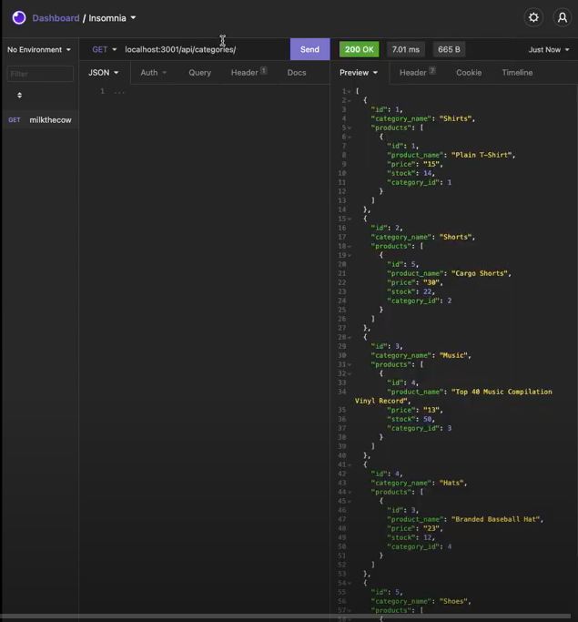

  # MilkeTheCow
  

  ## Description 
    * build the back end for an e-commerce site. You’ll take a working Express.js API and configure it to use Sequelize to interact with a MySQL database., using Node.js, Inquirer, and MySQL.
  ## Table of Contents (Optional)
  
  * [Installation](#installation)
  * [Usage](#usage)
  * [Credits](#credits)
  * [License](#license)

  ## Installation
    * To install: download from github, enter "npm start" in the command line.
    * Video Demo: https://www.youtube.com/watch?v=omdCbpED0fE
  
  ## Usage 
    * Use this program by: use it how you want.
  
  
  
  
  ## Credits
   * The following folks helped with this project: Me, myself, and I
  
  ## License
   * This project uses this license: https://opensource.org/licenses/MIT
  
  ## Badges
  
  * 
  
  ## Features
    * The project has the following features: JavaScript, Node, Express.js, SQL
  
  ## Contributing
    * If you'd contribute to this project, consider the following: contribute if you want. 
  ## Tests
    *N/A

  ## Questions?
  * Reach out to the repository owner spectocr, https://github.com/spectocr/buythecownotthemilk, or email at cris.spector@live.com

